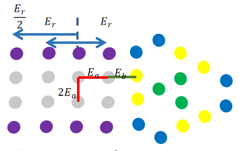
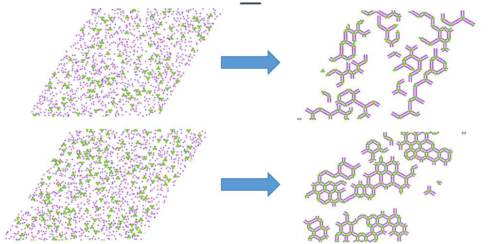

# README

This is the reproduction and further study for simulation part of paper:

Song, Yang, et al. "Size Control of On-Surface Self-Assembled Nanochains Using Soft Building Blocks." *The Journal of Physical Chemistry Letters* 14.50 (2023): 11324-11332.

modeling of organic molecular blocks:

some result with force control:

